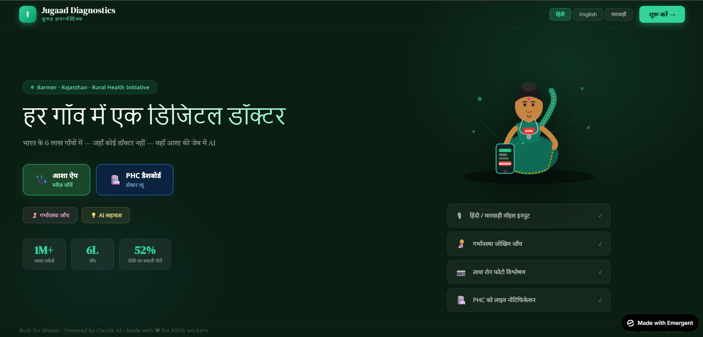
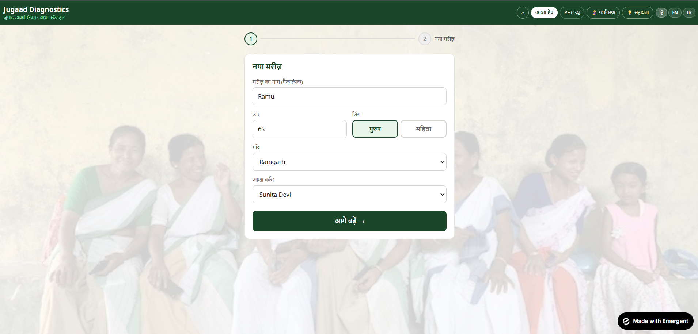
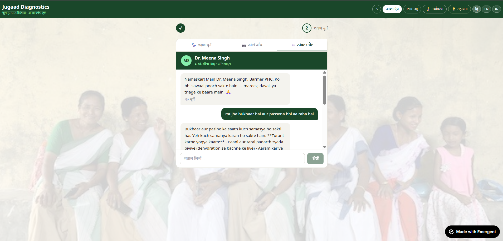
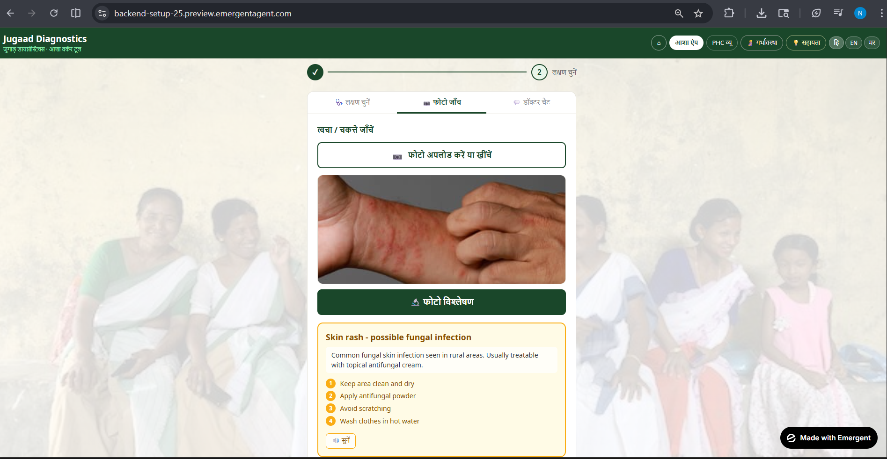
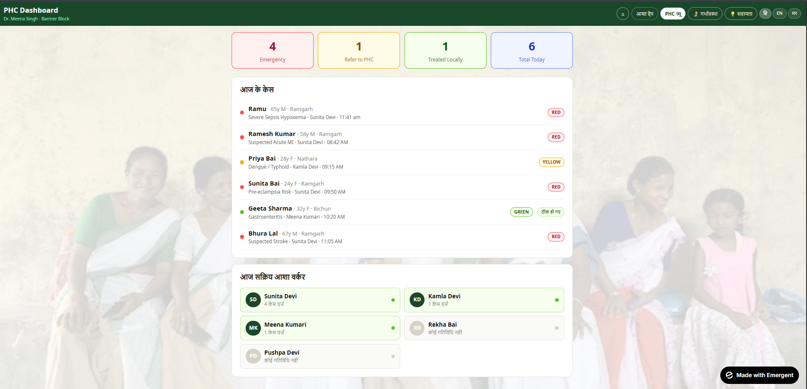
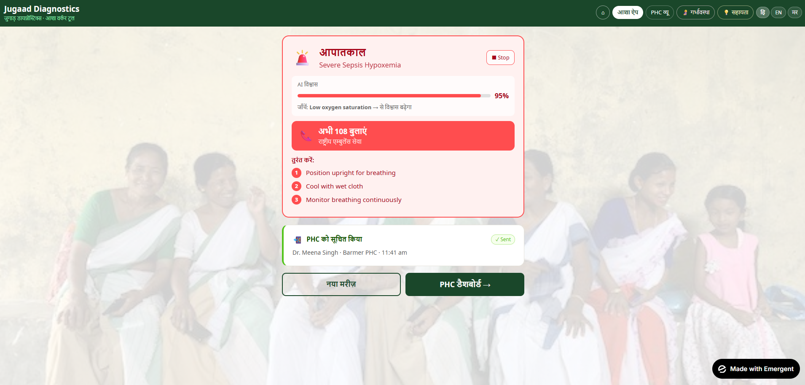
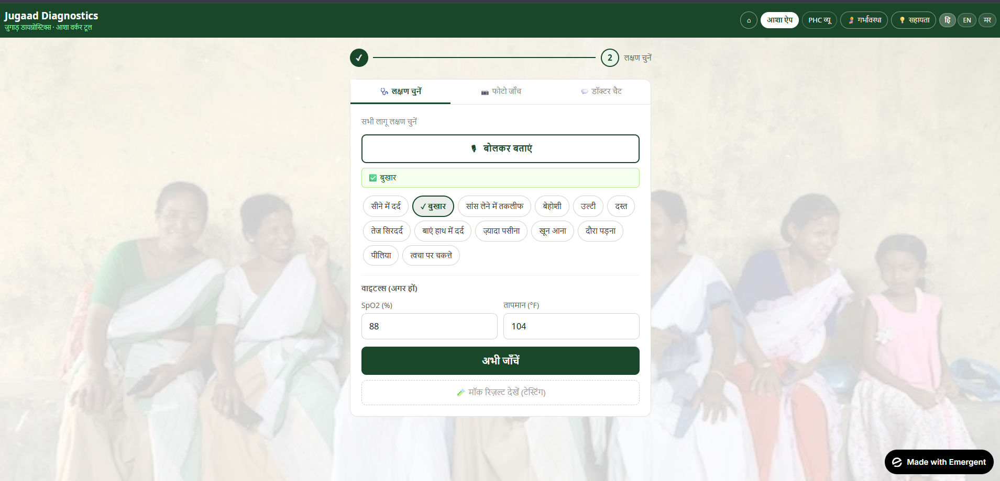

## 🚨 Problem Statement

Rural patients often travel 50+ km for basic diagnosis, leading to delays and preventable deaths.

## 💡 Our Solution

An AI-powered triage assistant enabling ASHA workers to perform early diagnosis and risk detection at village level.

## 👥 Team Members

- **Anshika Pandey** – [GitHub](https://github.com/anshikapandey1375-hue)
- **Nandini Mittal** – [GitHub](https://github.com/nandinimittal1018-cloud)
- **Padmini Singh Tanwar** – [GitHub](https://github.com/Padmini0)
- **Riya Sharma** – [GitHub](https://github.com/riya-rs23)


"# ASHA Jugaad Diagnostics - Rural Health Triage System

## Overview

This is a complete AI-powered health triage system designed for ASHA (Accredited Social Health Activist) workers in rural India. The application uses **Claude Sonnet 4** via **Emergent LLM Keys** to provide intelligent medical assessments, pregnancy risk evaluation, and real-time assistance.

## 🎯 Features

### 1. **Main Patient Triage**
- Comprehensive symptom analysis
- Risk level assessment (RED/YELLOW/GREEN)
- First aid recommendations
- Automatic 108 ambulance alerts for emergencies
- Supports vitals input (SpO2, temperature)

### 2. **Pregnancy Risk Assessment** 🤰
- Maternal health evaluation
- Danger sign detection
- ANC visit recommendations
- JSSK/PM-JAY benefit information
- Multi-language support

### 3. **PHC Dashboard** 🏥
- Real-time case monitoring
- Outbreak detection (cluster alerts)
- ASHA worker activity tracking
- Emergency case highlighting

### 4. **Image Analysis** 📷
- Skin condition photo analysis
- Home care recommendations
- PHC referral guidance
- *(Currently using mock data - can be enhanced)*

### 5. **AI Assistants**
- **PHC Doctor Chat**: Interactive consultation with AI doctor
- **ASHA Copilot**: 24/7 AI assistant for field workers
- Context-aware responses
- Emergency protocol guidance

### 6. **Multilingual** 🌍
- English
- Hindi (हिंदी)
- Marwari (मारवाड़ी)
- Voice input support

 
## 🌐 Live App
👉 https://asha-jugaad-diagnostics.vercel.app

## 🎥 Demo Video
👉 https://backend-setup-25.preview.emergentagent.com

🧪 Try these use cases:
- Emergency triage (chest pain, breathlessness)
- Pregnancy risk assessment
- AI doctor chat
- ASHA Copilot assistance

> 💡 No login required. Works directly in browser.

## 📸 Screenshots

### 🏠 Home Page


### 📝 Form Page


### 🤖 Doctor Chat Interface


### 🧠 Image Analysis


### 📊 PHC Dashboard


### 🤰 Pregnancy Analysis - Step 1
.png)

### 🤰 Pregnancy Analysis - Step 2
.png)

### 🤰 Pregnancy Analysis - Step 3
.png)

### 📈 Result Page


### 🎤 Symptoms & Audio Input


## 🚀 Quick Start

### Prerequisites
- All services are already running!
- Backend: Port 8001
- Frontend: Port 3000
- MongoDB: Port 27017

### Access the Application

**Frontend URL**: https://backend-setup-25.preview.emergentagent.com

**Backend API**: https://backend-setup-25.preview.emergentagent.com/api/

## 🔧 Technical Stack

### Backend
- **Framework**: FastAPI
- **AI Integration**: Emergent LLM (Claude Sonnet 4)
- **Database**: MongoDB
- **Language**: Python 3.x

### Frontend
- **Framework**: React 19
- **Styling**: Inline styles (self-contained)
- **Language Support**: Multi-language (EN/HI/MR)

## 📡 API Documentation

### Main Endpoint: `/api/messages`

**Request:**
```json
POST /api/messages
Content-Type: application/json

{
  \"model\": \"claude-sonnet-4-20250514\",
  \"max_tokens\": 1000,
  \"system\": \"Optional system message\",
  \"messages\": [
    {
      \"role\": \"user\",
      \"content\": \"Your message here\"
    }
  ]
}
```

**Response:**
```json
{
  \"id\": \"msg_...\",
  \"type\": \"message\",
  \"role\": \"assistant\",
  \"content\": [
    {
      \"type\": \"text\",
      \"text\": \"AI response\"
    }
  ],
  \"model\": \"claude-sonnet-4-20250514\",
  \"stop_reason\": \"end_turn\",
  \"usage\": {
    \"input_tokens\": 50,
    \"output_tokens\": 100
  }
}
```

## 🧪 Testing

Run the test suite:
```bash
/app/test_backend.sh
```

This will test:
- Health check endpoint
- Emergency triage
- Pregnancy assessment
- Doctor chat
- ASHA copilot

## 📁 Project Structure

```
/app/
├── backend/
│   ├── server.py           # Main FastAPI application
│   ├── requirements.txt    # Python dependencies
│   └── .env               # Environment variables (includes EMERGENT_LLM_KEY)
├── frontend/
│   ├── src/
│   │   ├── App.js         # Main React component (ASHA Diagnostics UI)
│   │   ├── App.css        # Minimal styles
│   │   └── index.js       # React entry point
│   ├── package.json       # Node dependencies
│   └── .env              # Frontend environment (BACKEND_URL)
├── test_backend.sh        # API test suite
└── IMPLEMENTATION_SUMMARY.md
```

## 🔑 Environment Variables

### Backend (`.env`)
```
MONGO_URL=mongodb://localhost:27017
DB_NAME=test_database
CORS_ORIGINS=*
EMERGENT_LLM_KEY=your_api_key_here
```

### Frontend (`.env`)
```
REACT_APP_BACKEND_URL=https://backend-setup-25.preview.emergentagent.com
```

## 💡 Usage Examples

### Example 1: Emergency Triage
```bash
curl -X POST https://backend-setup-25.preview.emergentagent.com/api/messages \
  -H \"Content-Type: application/json\" \
  -d '{
    \"model\": \"claude-sonnet-4-20250514\",
    \"max_tokens\": 300,
    \"messages\": [{
      \"role\": \"user\",
      \"content\": \"Rural India triage. Age:58, Sex:Male, Symptoms:chest pain, sweating, breathlessness, SpO2:93%\"
    }]
  }'
```

### Example 2: Pregnancy Assessment
```bash
curl -X POST https://backend-setup-25.preview.emergentagent.com/api/messages \
  -H \"Content-Type: application/json\" \
  -d '{
    \"model\": \"claude-sonnet-4-20250514\",
    \"max_tokens\": 500,
    \"messages\": [{
      \"role\": \"user\",
      \"content\": \"Maternal health assessment: Age 24, 28 weeks pregnant, BP 150/95, severe headache, swelling\"
    }]
  }'
```

## 🎨 Application Views

### 1. Landing Page
- Hero section with app introduction
- Quick access buttons
- Statistics display
- Feature highlights

### 2. ASHA Worker Interface
- Patient intake form
- Symptom selection
- Voice input (Hindi/Marwari)
- Vital signs input
- AI analysis results

### 3. PHC Dashboard
- Today's cases overview
- Emergency alerts
- Outbreak detection
- ASHA worker activity

### 4. Pregnancy Module
- Mother's information
- Symptom checklist
- Risk assessment
- ANC recommendations

### 5. Help/Copilot
- Quick questions
- AI chat interface
- Voice output
- Context-aware guidance

## 🔒 Security

- API keys stored in environment variables
- CORS configured
- No sensitive data in frontend
- Secure backend proxy for all AI calls

## 📊 Key Metrics

- **600,000+** Villages served
- **1M+** ASHA Workers
- **52%** Preventable deaths targeted
- **3 Languages** supported
- **5 AI Features** integrated

## 🚑 Emergency Protocol

The system automatically:
1. Identifies RED-level emergencies
2. Provides immediate first aid steps
3. Triggers 108 ambulance call recommendation
4. Notifies PHC in real-time

## 🛠️ Maintenance

### Restart Services
```bash
sudo supervisorctl restart all
```

### Check Service Status
```bash
sudo supervisorctl status
```

### View Logs
```bash
# Backend logs
tail -f /var/log/supervisor/backend.err.log

# Frontend logs
tail -f /var/log/supervisor/frontend.out.log
```

## 📝 Customization

### To modify AI behavior:
Edit the system messages in `/app/backend/server.py`

### To add new languages:
Update the `LANG` object in `/app/frontend/src/App.js`

### To change AI model:
Update the `.with_model()` call in server.py:
```python
.with_model(\"anthropic\", \"claude-4-sonnet-20250514\")
```

## 🎓 Credits

- Built for rural healthcare workers in Rajasthan, India
- Powered by Claude AI (Anthropic)
- Emergent LLM integration
- Made with ❤️ for ASHA workers

## 📞 Support

For issues or questions:
1. Check `/app/IMPLEMENTATION_SUMMARY.md`
2. Run `/app/test_backend.sh` to verify setup
3. Check service logs for errors

---

## ⚡ Quick Commands

```bash
# Test backend
curl http://localhost:8001/api/

# Restart all services
sudo supervisorctl restart all

# Run full test suite
/app/test_backend.sh

# View application
# Visit: https://backend-setup-25.preview.emergentagent.com
```

---

**Status**: ✅ Fully functional and ready to use!

**Version**: 4.0  
**Location**: Barmer, Rajasthan  
**Purpose**: Rural health triage and maternal care

## 🔄 Technical Workflow

1. ASHA worker inputs patient symptoms via frontend
2. Data is sent to FastAPI backend
3. Backend processes input and sends prompt to Claude Sonnet 4 via Emergent LLM
4. AI analyzes:
   - Symptoms
   - Vitals
   - Pregnancy risks (if applicable)
5. AI returns:
   - Risk level (RED/YELLOW/GREEN)
   - First aid suggestions
   - Referral advice
6. Results displayed to ASHA worker
7. Critical cases are flagged to PHC dashboard
